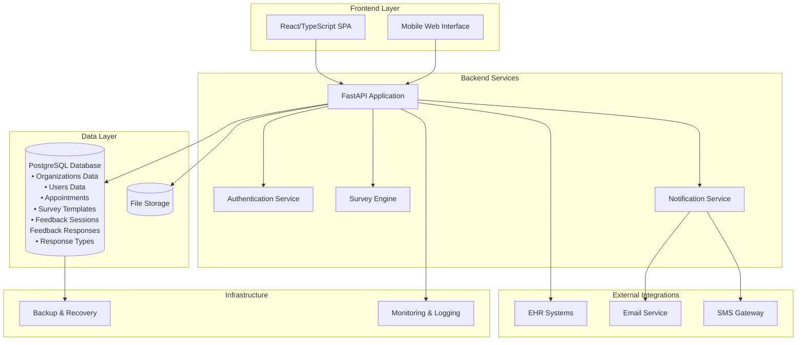
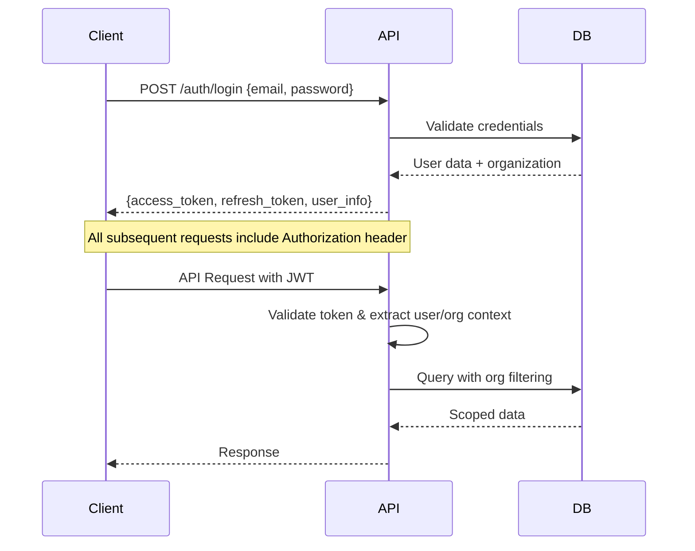
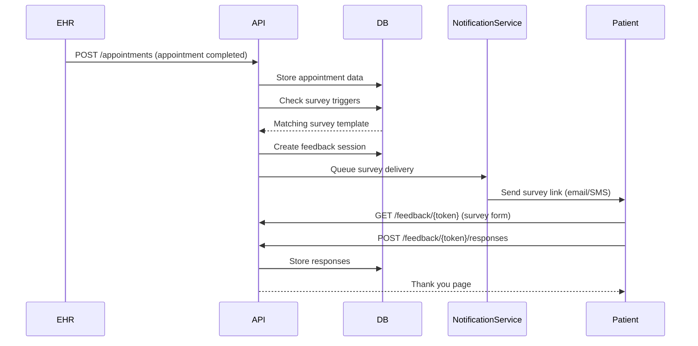

# Survey Collection Application Architecture

## System Overview

A multi-tenant healthcare survey collection platform that captures patient feedback after appointments through configurable surveys. The system supports multiple healthcare organizations with role-based access control and automated survey delivery.

## High-Level Architecture



## Technology Stack

### Frontend
- **Framework**: React 18+ with TypeScript
- **Build Tool**: Vite
- **Routing**: TanStack Router
- **State Management**: TanStack Query + Context API
- **UI Components**: Chakra UI or similar component library
- **Forms**: React Hook Form with Zod validation
- **Testing**: Vitest + Playwright for E2E

### Backend
- **Framework**: FastAPI with Python 3.11+
- **Database**: PostgreSQL 15+ with asyncpg
- **ORM**: SQLAlchemy 2.0 (async)
- **Authentication**: JWT with refresh tokens
- **Validation**: Pydantic v2
- **Migration**: Alembic
- **Background Tasks**: FastAPI BackgroundTasks (simple async tasks)
- **Testing**: pytest with async support

### Infrastructure
- **Containerization**: Docker + Docker Compose
- **File Storage**: Local filesystem
- **Monitoring**: Basic logging (optional: Prometheus + Grafana for production)
- **Deployment**: Docker containers

## Core Components

### 1. Authentication & Authorization
```
- Multi-tenant JWT-based authentication
- Role-based access control (Admin, Provider, Patient)
- Organization-scoped data isolation
- Secure password handling with bcrypt
- Refresh token rotation
```

### 2. User Management
```
- Unified user model supporting providers, patients, and admins
- Organization membership management
- Profile management with encrypted PII
- Opt-out/preference management for patients
```

### 3. Survey Engine
```
- Dynamic survey template creation with JSONB storage
- Configurable question types (rating, text, multiple choice)
- Trigger-based survey delivery (post-appointment)
- Survey versioning and A/B testing support
- Response validation and storage
```

### 4. Appointment Integration
```
- External EHR system integration via APIs
- Appointment data synchronization
- Provider-patient relationship mapping
- Clinical context capture (diagnoses, visit type)
```

### 5. Notification System
```
- Multi-channel delivery (email, SMS, web)
- Configurable delivery timing and retries
- Template-based messaging
- Delivery tracking and analytics
```

### 6. Analytics & Reporting
```
- Response aggregation and analysis
- Organization-level dashboards
- Provider performance insights
- Patient satisfaction trends
- Export capabilities (CSV, PDF)
```

## API Architecture

### REST API Structure
```
/api/v1/
├── auth/                 # Authentication endpoints
│   ├── login
│   ├── refresh
│   └── logout
├── organizations/        # Organization management
├── users/               # User CRUD (providers, patients, admins)
├── appointments/        # Appointment data
├── surveys/            # Survey template management
│   ├── templates/
│   └── responses/
├── feedback/           # Feedback session management
│   ├── sessions/
│   └── responses/
└── analytics/          # Reporting endpoints
```

### Authentication Flow


## Data Flow - Survey Collection

### Survey Delivery Process


## Security Considerations

### Data Protection
- **Encryption**: PII fields encrypted at rest (phone, email)
- **HTTPS**: All communications over TLS
- **Input Validation**: Comprehensive validation using Pydantic
- **SQL Injection**: Protected via SQLAlchemy ORM
- **CORS**: Properly configured for frontend domains

### Access Control
- **Multi-tenancy**: Organization-scoped data isolation
- **Role-based permissions**: Admin, Provider, Patient roles
- **API Rate Limiting**: Prevent abuse and DoS
- **Token Management**: JWT with short expiration + refresh tokens

### Compliance
- **HIPAA Considerations**: Audit logging, data minimization
- **Data Retention**: Configurable retention policies
- **Consent Management**: Patient opt-out capabilities

## Deployment Architecture

### Development Environment
```yaml
services:
  frontend:
    build: ./frontend
    ports: ["3000:3000"]
  
  backend:
    build: ./backend
    ports: ["8000:8000"]
    depends_on: [db]
  
  db:
    image: postgres:15
    volumes: [postgres_data:/var/lib/postgresql/data]
    environment:
      POSTGRES_DB: survey_collection
      POSTGRES_USER: postgres
      POSTGRES_PASSWORD: password
```

### Production Considerations (Future)
- **Container Orchestration**: Docker Compose (MVP) → Kubernetes (scale)
- **Database**: Managed PostgreSQL service
- **Load Balancing**: Add Nginx/Traefik when scaling beyond single instance
- **SSL**: Let's Encrypt certificates
- **Monitoring**: Application logs → structured logging + monitoring

## Scalability & Performance

### MVP Performance Considerations
- **Database Indexing**: Optimized queries for multi-tenant data
- **Async Processing**: FastAPI BackgroundTasks for email/SMS notifications
- **Connection Pooling**: SQLAlchemy connection pooling
- **Simple Caching**: In-memory caching for survey templates

### Future Scaling (Post-MVP)
- **Horizontal Scaling**: Multiple API instances behind load balancer
- **Database Scaling**: Read replicas for analytics queries
- **External Caching**: Redis for session data and frequent queries
- **CDN**: Static asset delivery for frontend

## Future Enhancements

### Phase 2 Features
- **Real-time Analytics**: WebSocket-based live dashboards
- **Advanced Survey Logic**: Conditional branching, skip patterns
- **Integration Marketplace**: Plugin system for EHR integrations
- **Mobile Apps**: Native iOS/Android applications
- **AI Insights**: Sentiment analysis and automated insights
- **White-label**: Customizable branding per organization

### Technical Improvements
- **Microservices**: Break down monolithic API
- **Event Sourcing**: Audit trail and data versioning
- **GraphQL**: Flexible query interface for complex UIs
- **Kubernetes**: Container orchestration for large scale
