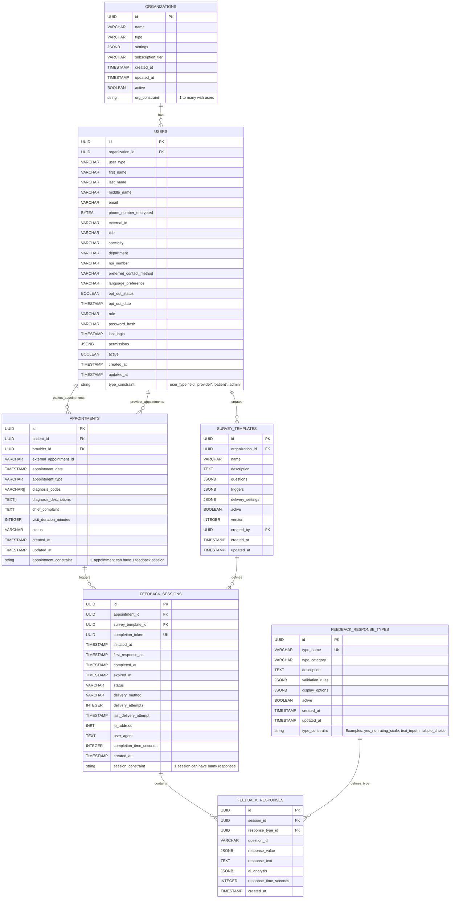

## Data Model

I'll read the updated data model file to provide you with a current summary.

[1 tool called]

Based on the updated data model, here's a summary of your survey collection application's entities:

## Data Model Summary

### Core Entities

**1. Organizations**
- Multi-tenant container for all application data
- Fields: `name`, `type`, `settings` (JSONB), `subscription_tier`, `active` status, timestamps
- Acts as the root entity for data isolation

**2. Users** *(Consolidated entity combining providers, patients, and admin users)*
- Single unified user table with `user_type` field ('provider', 'patient', 'admin')
- Universal fields: `first_name`, `last_name`, `middle_name`, `email`, `phone_number_encrypted`, `external_id`
- Provider-specific: `title`, `specialty`, `department`, `npi_number`
- Patient-specific: `preferred_contact_method`, `language_preference`, `opt_out_status`, `opt_out_date`
- Auth/Admin: `role`, `password_hash`, `last_login`, `permissions` (JSONB)
- Status: `active`, timestamps

**3. Appointments**
- Care encounters between patients and providers (both referenced as `USERS`)
- Fields: `patient_id`, `provider_id`, `external_appointment_id`, `appointment_date`, `appointment_type`
- Clinical data: `diagnosis_codes` (array), `diagnosis_descriptions` (array), `chief_complaint`, `visit_duration_minutes`
- Status tracking and timestamps

**4. Survey Templates**
- Versioned survey definitions per organization
- Fields: `name`, `description`, `questions` (JSONB), `triggers` (JSONB), `delivery_settings` (JSONB)
- Metadata: `active`, `version`, `created_by` (FK to USERS), timestamps

**5. Feedback Sessions**
- Individual survey instances triggered by appointments
- Tracking: `completion_token` (unique), session timing (`initiated_at`, `first_response_at`, `completed_at`, `expired_at`)
- Delivery: `delivery_method`, `delivery_attempts`, `last_delivery_attempt`
- Analytics: `ip_address`, `user_agent`, `completion_time_seconds`

**6. Feedback Response Types**
- Catalog of allowable response formats
- Examples: yes_no, rating_scale, text_input, multiple_choice
- Fields: `type_name`, `type_category`, `validation_rules` (JSONB), `display_options` (JSONB)

**7. Feedback Responses**
- Individual answers within feedback sessions
- Fields: `question_id`, `response_value` (JSONB), `response_text`, `ai_analysis` (JSONB)
- Performance tracking: `response_time_seconds`

### Relationship Flow
1. **Organization** → **Users** (providers, patients, admins)
2. **Users** → **Appointments** (patients attend, providers conduct)
3. **Appointments** → **Feedback Sessions** (trigger surveys)
4. **Survey Templates** → **Feedback Sessions** (define structure)
5. **Feedback Sessions** → **Feedback Responses** (collect answers)
6. **Response Types** → **Responses** (define format/validation)

This design supports multi-tenant healthcare organizations collecting patient feedback through configurable surveys triggered by appointment events.