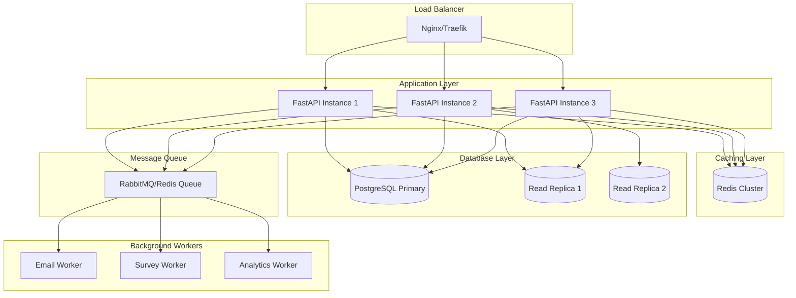
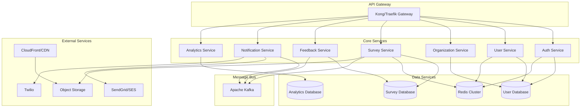
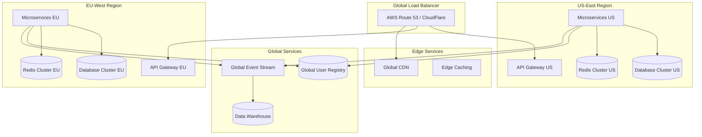

# Survey Collection Application - Scaling Architecture

## Executive Summary

This document outlines the scaling strategy for the Survey Collection Application, detailing how to evolve from the current MVP architecture to support enterprise-scale deployments with thousands of organizations, millions of users, and high-throughput survey collection workflows.

## Current State vs. Target Scale

### MVP Architecture (Current)
- **Users**: 100-1,000 concurrent users
- **Organizations**: 10-50 healthcare organizations
- **Throughput**: 1,000-10,000 surveys/day
- **Infrastructure**: Single Docker Compose deployment
- **Database**: Single PostgreSQL instance

### Enterprise Scale (Target)
- **Users**: 10,000-100,000 concurrent users
- **Organizations**: 1,000+ healthcare organizations
- **Throughput**: 1M+ surveys/day
- **Infrastructure**: Kubernetes cluster with auto-scaling
- **Database**: Distributed PostgreSQL with read replicas

## Scaling Phases

### Phase 1: Vertical Scaling (0-6 months)
**Target**: 1,000-5,000 concurrent users



**Key Changes:**
- **Horizontal API Scaling**: 3+ FastAPI instances behind load balancer
- **Database Read Replicas**: Separate read/write operations
- **Redis Caching**: Session storage, survey templates, user data
- **Background Task Queue**: Async processing for notifications
- **Container Orchestration**: Migrate to Kubernetes

### Phase 2: Service Decomposition (6-18 months)
**Target**: 10,000-25,000 concurrent users



**Key Changes:**
- **Microservices Architecture**: Domain-driven service decomposition
- **Database Per Service**: Dedicated databases for bounded contexts
- **Event-Driven Architecture**: Kafka for inter-service communication
- **API Gateway**: Centralized routing, auth, rate limiting
- **External Services**: Managed email, SMS, and storage

### Phase 3: Global Scale (18+ months)
**Target**: 100,000+ concurrent users, multi-region



**Key Changes:**
- **Multi-Region Deployment**: Geographic distribution for performance
- **Global Data Synchronization**: Cross-region data consistency
- **Edge Computing**: Regional processing and caching
- **Data Warehouse**: Centralized analytics and reporting

## Detailed Scaling Strategies

### 1. Database Scaling

#### Current State
```sql
-- Single PostgreSQL instance
-- All data in one database
-- Basic indexing for multi-tenant queries
```

#### Phase 1: Read Replicas & Optimization
```sql
-- Primary-Replica Setup
PRIMARY: survey_collection_primary (write operations)
REPLICA_1: survey_collection_read_1 (read operations - surveys)
REPLICA_2: survey_collection_read_2 (read operations - analytics)

-- Optimized Indexing
CREATE INDEX CONCURRENTLY idx_survey_templates_org_active 
ON survey_templates (organization_id, active) 
WHERE active = true;

CREATE INDEX CONCURRENTLY idx_feedback_responses_session_created 
ON feedback_responses (feedback_session_id, created_at);

-- Partitioning for Large Tables
CREATE TABLE feedback_responses_y2024m01 PARTITION OF feedback_responses
FOR VALUES FROM ('2024-01-01') TO ('2024-02-01');
```

#### Phase 2: Database Per Service
```yaml
# Database Architecture
databases:
  user_service_db:
    tables: [users, organizations, user_sessions]
    replicas: 3
    
  survey_service_db:
    tables: [survey_templates, feedback_sessions]
    replicas: 2
    
  analytics_db:
    tables: [feedback_responses, aggregated_metrics]
    type: time_series_optimized
    replicas: 2
```

#### Phase 3: Distributed Database
```yaml
# Sharding Strategy
sharding:
  strategy: organization_id_hash
  shards: 16
  replication_factor: 3
  
# Cross-Region Replication
regions:
  us_east:
    primary_shards: [0, 1, 2, 3, 8, 9, 10, 11]
    replica_shards: [4, 5, 6, 7, 12, 13, 14, 15]
  eu_west:
    primary_shards: [4, 5, 6, 7, 12, 13, 14, 15]
    replica_shards: [0, 1, 2, 3, 8, 9, 10, 11]
```

### 2. Application Scaling

#### Current FastAPI Scaling
```python
# Current: Single FastAPI instance
# Target: Horizontal scaling with stateless design

# Phase 1: Multi-instance deployment
# docker-compose.yml
services:
  api-1:
    build: ./backend
    environment:
      - WORKER_ID=1
  api-2:
    build: ./backend
    environment:
      - WORKER_ID=2
  api-3:
    build: ./backend
    environment:
      - WORKER_ID=3
```

#### Phase 2: Microservices Implementation
```python
# auth_service/main.py
from fastapi import FastAPI
from auth_service.routes import auth_router

app = FastAPI(title="Auth Service")
app.include_router(auth_router, prefix="/auth")

# survey_service/main.py
from fastapi import FastAPI
from survey_service.routes import survey_router

app = FastAPI(title="Survey Service")
app.include_router(survey_router, prefix="/surveys")

# Service Discovery with Consul/etcd
import consul

consul_client = consul.Consul()
consul_client.agent.service.register(
    name="survey-service",
    service_id="survey-service-1",
    address="10.0.1.100",
    port=8000,
    check=consul.Check.http("http://10.0.1.100:8000/health")
)
```

### 3. Caching Strategy

#### Phase 1: Redis Implementation
```python
# Cache Layer Architecture
import redis.asyncio as redis
from typing import Optional

class CacheService:
    def __init__(self):
        self.redis = redis.Redis(host='redis-cluster')
    
    async def get_survey_template(self, template_id: str, org_id: str) -> Optional[dict]:
        cache_key = f"survey_template:{org_id}:{template_id}"
        cached = await self.redis.get(cache_key)
        if cached:
            return json.loads(cached)
        return None
    
    async def set_survey_template(self, template_id: str, org_id: str, data: dict, ttl: int = 3600):
        cache_key = f"survey_template:{org_id}:{template_id}"
        await self.redis.setex(cache_key, ttl, json.dumps(data))

# Cache Patterns
CACHE_PATTERNS = {
    "survey_templates": {"ttl": 3600, "pattern": "survey_template:{org_id}:{template_id}"},
    "user_sessions": {"ttl": 1800, "pattern": "session:{user_id}"},
    "organization_config": {"ttl": 7200, "pattern": "org_config:{org_id}"},
    "survey_responses": {"ttl": 300, "pattern": "responses:{session_id}"}
}
```

#### Phase 2: Multi-Level Caching
```yaml
# Caching Architecture
cache_layers:
  L1_application_cache:
    type: in_memory
    size: 100MB
    ttl: 60s
    
  L2_redis_cache:
    type: redis_cluster
    nodes: 6
    ttl: 3600s
    
  L3_cdn_cache:
    type: cloudfront
    ttl: 86400s
    objects: [static_assets, survey_forms]
```

### 4. Message Queue & Background Processing

#### Phase 1: Redis Queue
```python
# Background Task Processing
from rq import Queue
from redis import Redis

redis_conn = Redis(host='redis')
queue = Queue(connection=redis_conn)

# Survey Delivery Job
def send_survey_notification(feedback_session_id: str):
    # Fetch session details
    # Generate survey link
    # Send email/SMS
    # Update delivery status
    pass

# Enqueue job
queue.enqueue(send_survey_notification, feedback_session_id="123")
```

#### Phase 2: Apache Kafka
```python
# Event-Driven Architecture
from kafka import KafkaProducer, KafkaConsumer
import json

# Survey Events
class SurveyEventProducer:
    def __init__(self):
        self.producer = KafkaProducer(
            bootstrap_servers=['kafka-1:9092', 'kafka-2:9092'],
            value_serializer=lambda v: json.dumps(v).encode('utf-8')
        )
    
    def appointment_completed(self, appointment_data: dict):
        self.producer.send('appointment.completed', appointment_data)
    
    def survey_response_submitted(self, response_data: dict):
        self.producer.send('survey.response.submitted', response_data)

# Event Consumers
class NotificationService:
    def consume_appointment_events(self):
        consumer = KafkaConsumer(
            'appointment.completed',
            bootstrap_servers=['kafka-1:9092'],
            value_deserializer=lambda m: json.loads(m.decode('utf-8'))
        )
        
        for message in consumer:
            appointment = message.value
            # Trigger survey delivery
            self.schedule_survey_delivery(appointment)
```

### 5. Monitoring & Observability

#### Phase 1: Basic Monitoring
```yaml
# Docker Compose Monitoring Stack
monitoring:
  prometheus:
    image: prom/prometheus
    config: ./prometheus.yml
    
  grafana:
    image: grafana/grafana
    dashboards: ./dashboards/
    
  alertmanager:
    image: prom/alertmanager
    config: ./alertmanager.yml

# Application Metrics
python_metrics:
  - request_duration_histogram
  - active_users_gauge
  - survey_completion_rate
  - database_connection_pool_size
```

#### Phase 2: Full Observability
```python
# Distributed Tracing
from opentelemetry import trace
from opentelemetry.exporter.jaeger import JaegerExporter
from opentelemetry.sdk.trace import TracerProvider

# Custom Metrics
from prometheus_client import Counter, Histogram, Gauge

SURVEY_REQUESTS = Counter('survey_requests_total', 'Total survey requests')
RESPONSE_TIME = Histogram('survey_response_time_seconds', 'Survey response time')
ACTIVE_SESSIONS = Gauge('active_feedback_sessions', 'Active feedback sessions')

# Structured Logging
import structlog

logger = structlog.get_logger()
logger.info("Survey completed", 
           survey_id="123", 
           organization_id="org-456", 
           completion_time=1.23)
```

### 6. Security Scaling

#### Phase 1: Enhanced Security
```python
# Rate Limiting
from slowapi import Limiter, _rate_limit_exceeded_handler
from slowapi.util import get_remote_address

limiter = Limiter(key_func=get_remote_address)

@app.get("/api/v1/surveys")
@limiter.limit("100/minute")
async def get_surveys(request: Request):
    pass

# API Key Management
class APIKeyService:
    async def validate_api_key(self, api_key: str, organization_id: str) -> bool:
        # Validate against database
        # Check rate limits
        # Log access
        pass
```

#### Phase 2: Zero Trust Architecture
```yaml
# Security Architecture
security:
  identity_provider: Auth0/Okta
  api_gateway_auth: JWT validation
  service_mesh: Istio with mTLS
  secrets_management: HashiCorp Vault
  
  network_policies:
    - deny_all_default
    - allow_frontend_to_api_gateway
    - allow_api_gateway_to_services
    - allow_services_to_databases
```

## Performance Benchmarks

### Target Performance Metrics

#### Phase 1 Targets
- **API Response Time**: p95 < 200ms
- **Database Query Time**: p95 < 50ms
- **Survey Load Time**: < 2 seconds
- **Throughput**: 1,000 RPS
- **Availability**: 99.5%

#### Phase 2 Targets
- **API Response Time**: p95 < 100ms
- **Database Query Time**: p95 < 25ms
- **Survey Load Time**: < 1 second
- **Throughput**: 10,000 RPS
- **Availability**: 99.9%

#### Phase 3 Targets
- **API Response Time**: p95 < 50ms
- **Database Query Time**: p95 < 10ms
- **Survey Load Time**: < 500ms
- **Throughput**: 100,000 RPS
- **Availability**: 99.99%

### Load Testing Strategy

```python
# Locust Load Testing
from locust import HttpUser, task, between

class SurveyUser(HttpUser):
    wait_time = between(1, 3)
    
    def on_start(self):
        # Login and get auth token
        response = self.client.post("/api/v1/auth/login", json={
            "email": "test@example.com",
            "password": "password"
        })
        self.token = response.json()["access_token"]
        self.headers = {"Authorization": f"Bearer {self.token}"}
    
    @task(3)
    def get_surveys(self):
        self.client.get("/api/v1/survey-templates", headers=self.headers)
    
    @task(1)
    def submit_response(self):
        self.client.post("/api/v1/feedback-responses", 
                        json={"responses": {"q1": "5"}},
                        headers=self.headers)

# Load Test Scenarios
scenarios = [
    {"users": 100, "spawn_rate": 10, "duration": "5m"},    # Phase 1
    {"users": 1000, "spawn_rate": 50, "duration": "10m"},  # Phase 2
    {"users": 10000, "spawn_rate": 100, "duration": "30m"} # Phase 3
]
```

## Cost Optimization

### Phase 1 Cost Structure
```yaml
infrastructure_costs:
  compute:
    - 3x API servers: $150/month
    - 1x Database server: $200/month
    - 1x Redis server: $50/month
    - Load balancer: $25/month
  
  storage:
    - Database storage: $50/month
    - File storage: $25/month
    - Backups: $30/month
  
  total_monthly: ~$530
  cost_per_user: ~$0.50 (1000 active users)
```

### Phase 2 Cost Structure
```yaml
infrastructure_costs:
  compute:
    - Kubernetes cluster: $800/month
    - Managed databases: $600/month
    - Redis cluster: $200/month
    - Message queue: $150/month
  
  external_services:
    - Email service: $100/month
    - SMS service: $200/month
    - Monitoring: $100/month
  
  total_monthly: ~$2,150
  cost_per_user: ~$0.20 (10,000 active users)
```

### Phase 3 Cost Structure
```yaml
infrastructure_costs:
  multi_region:
    - US region: $5,000/month
    - EU region: $4,000/month
    - Global services: $2,000/month
  
  data_transfer: $500/month
  cdn: $300/month
  
  total_monthly: ~$11,800
  cost_per_user: ~$0.12 (100,000 active users)
```

## Migration Strategy

### Phase 1 Migration (Months 1-6)
1. **Week 1-2**: Set up CI/CD pipeline and staging environment
2. **Week 3-4**: Implement Redis caching layer
3. **Week 5-6**: Deploy load balancer and multiple API instances
4. **Week 7-8**: Set up database read replicas
5. **Week 9-12**: Implement background job processing
6. **Month 4-6**: Performance optimization and monitoring

### Phase 2 Migration (Months 7-18)
1. **Months 7-9**: Extract authentication service
2. **Months 10-12**: Extract survey and feedback services
3. **Months 13-15**: Implement API gateway and service discovery
4. **Months 16-18**: Event-driven architecture with Kafka

### Phase 3 Migration (Months 19+)
1. **Months 19-24**: Multi-region deployment
2. **Months 25-30**: Global data synchronization
3. **Months 31+**: Continuous optimization and feature development

## Risk Mitigation

### Technical Risks
- **Database Migration Complexity**: Use blue-green deployments
- **Service Communication Failures**: Implement circuit breakers
- **Data Consistency Issues**: Event sourcing and CQRS patterns
- **Performance Degradation**: Comprehensive load testing

### Operational Risks
- **Team Knowledge**: Gradual migration with training
- **Deployment Complexity**: Infrastructure as Code (Terraform)
- **Monitoring Gaps**: Implement observability early
- **Cost Overruns**: Regular cost reviews and optimization

## Success Metrics

### Technical KPIs
- Response time percentiles (p50, p95, p99)
- Error rates by service
- System availability and uptime
- Resource utilization efficiency

### Business KPIs
- Survey completion rates
- User engagement metrics
- Customer satisfaction scores
- Revenue per user growth

This scaling architecture provides a clear roadmap for evolving the Survey Collection Application from its current MVP state to enterprise-scale deployment, ensuring performance, reliability, and cost-effectiveness at each phase of growth.
