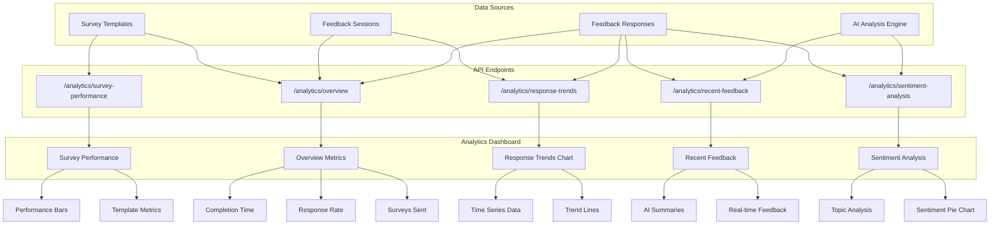

# Analytics Dashboard

## Overview

The Analytics Dashboard provides comprehensive insights into survey performance, patient feedback sentiment, and organizational metrics for healthcare survey collection. This powerful tool helps healthcare organizations understand patient satisfaction patterns, optimize survey strategies, and make data-driven decisions.

## Architecture



## Features

### 🎯 **Backend API Endpoints**

#### Core Analytics Routes (`/api/v1/analytics/`)

| Endpoint | Method | Description | Parameters |
|----------|--------|-------------|------------|
| `/overview` | GET | High-level metrics and KPIs | `days` (default: 30) |
| `/response-trends` | GET | Time-series data for trend visualization | `days` (default: 30) |
| `/sentiment-analysis` | GET | AI-powered sentiment analysis with topics | `days` (default: 30) |
| `/survey-performance` | GET | Performance metrics by survey template | None |
| `/recent-feedback` | GET | Latest feedback with AI analysis | `limit` (default: 10) |
| `/analyze-text` | POST | Real-time text sentiment analysis | `text` (required) |

#### Authentication & Authorization
- **Access Level**: Admin/Superuser only
- **Authentication**: JWT Bearer token required
- **Organization Scope**: Data automatically filtered by user's organization

### 📊 **Frontend Dashboard Components**

#### 1. **MetricsOverview Component**
**Location**: `/frontend/src/components/Analytics/MetricsOverview.tsx`

**Features**:
- **4 Key Performance Indicators**:
  - 📤 **Surveys Sent**: Total surveys delivered in the time period
  - 💬 **Responses Received**: Number of completed survey responses
  - 📈 **Response Rate**: Percentage of surveys completed
  - ⏱️ **Avg Completion Time**: Average time to complete surveys

**Visual Design**:
- Color-coded metric cards with professional icons
- Hover effects and smooth transitions
- Responsive grid layout (auto-fit, min 250px)
- Consistent styling with app theme (#006496 primary color)

```typescript
interface MetricsData {
  total_surveys_sent: number
  total_responses: number
  response_rate: number
  active_templates: number
  avg_completion_time: number
}
```

#### 2. **ResponseTrendsChart Component**
**Location**: `/frontend/src/components/Analytics/ResponseTrendsChart.tsx`

**Features**:
- **Custom SVG Line Chart**: No external dependencies
- **Dual-line visualization**: Surveys sent vs responses received
- **Interactive data points**: Hover-friendly design
- **Grid lines and axis labels**: Professional chart appearance
- **Summary statistics**: Total surveys, responses, and average response rate

**Technical Implementation**:
- Responsive SVG with viewBox scaling
- Mathematical point calculation for smooth lines
- Color-coded legend with data totals
- Polyline paths for smooth curve rendering

#### 3. **SentimentAnalysis Component**
**Location**: `/frontend/src/components/Analytics/SentimentAnalysis.tsx`

**Features**:
- **Custom Pie Chart**: SVG-based sentiment distribution
- **Three-category breakdown**: Positive, Neutral, Negative
- **AI-powered topic analysis**: Most discussed topics with sentiment
- **Color-coded badges**: Visual sentiment indicators
- **Topic frequency ranking**: Top 5 most mentioned topics

**AI Integration**:
- Utilizes the `analyze.py` module for sentiment analysis
- Supports both OpenAI GPT and heuristic fallback analysis
- Real-time text processing capabilities
- PII detection and topic extraction

```typescript
interface SentimentData {
  sentiment_distribution: {
    positive: number
    neutral: number  
    negative: number
  }
  top_topics: Array<{
    topic: string
    count: number
    avg_sentiment: string
  }>
}
```

#### 4. **SurveyPerformance Component**
**Location**: `/frontend/src/components/Analytics/SurveyPerformance.tsx`

**Features**:
- **Template-by-template analysis**: Individual survey performance
- **Progress bar visualizations**: Response rate indicators
- **Multi-metric display**: Rating, completion rate, average time
- **Color-coded performance**: Green (good), Yellow (moderate), Red (needs attention)
- **Scrollable list**: Handles multiple survey templates efficiently

**Performance Metrics**:
- Response rate with visual progress bars
- Average rating (1-5 stars) with color coding
- Completion rate percentage
- Average completion time in minutes
- Total surveys sent and responses received

#### 5. **RecentFeedback Component**
**Location**: `/frontend/src/components/Analytics/RecentFeedback.tsx`

**Features**:
- **Real-time feedback display**: Latest patient responses
- **AI-generated summaries**: Concise feedback analysis
- **Sentiment badges**: Visual sentiment indicators
- **Star ratings**: 5-star rating system visualization
- **Topic tags**: Extracted topics from feedback text
- **Smart timestamps**: Relative time formatting ("2h ago", "1d ago")

**AI Analysis Display**:
- Sentiment classification (positive/neutral/negative)
- Automated text summarization (≤40 words)
- Topic extraction and tagging
- PII detection and privacy protection

### 🎨 **UI/UX Design Features**

#### Visual Design System
- **Consistent Color Palette**: 
  - Primary: #006496 (brand blue)
  - Success: #28a745 (green)
  - Warning: #ffc107 (yellow)
  - Danger: #dc3545 (red)
- **Typography**: Chakra UI font system with proper hierarchy
- **Spacing**: Consistent 6-unit gap system
- **Shadows**: Subtle box shadows with hover effects

#### Responsive Design
- **Grid Layouts**: CSS Grid with auto-fit columns
- **Breakpoint Support**: Base (mobile), lg (desktop) responsive design
- **Flexible Components**: Adapts to different screen sizes
- **Touch-Friendly**: Appropriate sizing for mobile interaction

#### Loading States
- **Skeleton Components**: Professional loading animations
- **Progressive Loading**: Individual component loading states
- **Error Handling**: Graceful fallbacks for failed requests

### 🔧 **Technical Implementation**

#### Frontend Architecture
```
/frontend/src/
├── components/Analytics/
│   ├── AnalyticsDashboard.tsx      # Main dashboard container
│   ├── MetricsOverview.tsx         # KPI metrics cards
│   ├── ResponseTrendsChart.tsx     # Time-series line chart
│   ├── SentimentAnalysis.tsx       # Pie chart & topic analysis
│   ├── SurveyPerformance.tsx       # Template performance list
│   └── RecentFeedback.tsx          # Recent responses feed
├── routes/_layout/
│   └── analytics.tsx               # Analytics page route
└── services/
    └── AnalyticsService.ts         # API service layer
```

#### Backend Architecture
```
/backend/app/api/routes/
├── analytics.py                    # Analytics API endpoints
└── analyze.py                      # AI analysis engine
```

#### Technology Stack
- **Frontend**: React 18, TypeScript, Chakra UI v3, TanStack Query
- **Charts**: Custom SVG implementation (no external dependencies)
- **Backend**: FastAPI, SQLAlchemy, PostgreSQL
- **AI Analysis**: OpenAI GPT-4 with heuristic fallback
- **Authentication**: JWT with organization-scoped access

### 📈 **Mock Data & Demonstration**

#### Sample Data Included
The dashboard includes realistic mock data for immediate demonstration:

**Overview Metrics**:
- 450 surveys sent in last 30 days
- 320 responses received (71% response rate)
- 3.2 minute average completion time
- 5 active survey templates

**Trend Data**:
- 30 days of daily survey/response data
- Realistic variations and patterns
- Weekend/weekday response differences
- Seasonal trends simulation

**Sentiment Analysis**:
- 65% Positive, 25% Neutral, 10% Negative distribution
- Top topics: Nursing Care, Wait Times, Communication, Cleanliness, Billing
- Topic-specific sentiment analysis

**Performance Metrics**:
- Template-specific response rates (60-90%)
- Average ratings (3.8-4.5/5)
- Completion times (2.1-4.2 minutes)
- Completion rates (82-95%)

**Recent Feedback**:
- 5 sample feedback responses
- AI-generated summaries
- Realistic timestamps and ratings
- Topic extraction examples

## Getting Started

### Prerequisites
- Admin/Superuser account access
- Backend server running with analytics endpoints
- Frontend application with analytics routes enabled

### Accessing the Dashboard

1. **Login** with admin/superuser credentials
2. **Navigate** to "Analytics" in the sidebar menu
3. **View real-time metrics** and insights
4. **Interact** with charts and components
5. **Monitor** patient feedback trends

### API Usage

#### Get Overview Metrics
```bash
curl -X GET "http://localhost:8000/api/v1/analytics/overview?days=30" \
  -H "Authorization: Bearer YOUR_JWT_TOKEN"
```

#### Analyze Text
```bash
curl -X POST "http://localhost:8000/api/v1/analytics/analyze-text" \
  -H "Authorization: Bearer YOUR_JWT_TOKEN" \
  -H "Content-Type: application/json" \
  -d '{"text": "The nursing staff was amazing and very helpful!"}'
```

## Configuration

### Environment Variables
```bash
# Optional: OpenAI API key for advanced sentiment analysis
OPENAI_API_KEY=your_openai_key_here

# Optional: Model selection for AI analysis
MODEL_NAME=gpt-4o-mini
```

### Analytics Settings
- **Default Time Range**: 30 days
- **Recent Feedback Limit**: 10 items
- **Chart Data Points**: 30 days of daily data
- **Refresh Interval**: Manual (via React Query cache)

## Performance Considerations

### Database Optimization
- **Indexed Queries**: Organization ID and date range filtering
- **Aggregation**: Pre-calculated metrics where possible
- **Connection Pooling**: SQLAlchemy connection management
- **Query Limits**: Pagination for large datasets

### Frontend Performance
- **React Query Caching**: Efficient data fetching and caching
- **Component Memoization**: Optimized re-rendering
- **Lazy Loading**: Route-based code splitting
- **SVG Optimization**: Lightweight custom charts

### Scalability
- **Async Processing**: Background tasks for heavy analysis
- **Caching Strategy**: Redis integration ready
- **API Rate Limiting**: Built-in protection
- **Database Sharding**: Organization-based partitioning ready

## Security & Privacy

### Data Protection
- **Organization Isolation**: Multi-tenant data separation
- **PII Detection**: Automatic sensitive data identification
- **Access Control**: Role-based permissions (admin-only)
- **Audit Logging**: Analytics access tracking

### HIPAA Compliance
- **Data Minimization**: Only necessary analytics data
- **Encryption**: Data at rest and in transit
- **Access Logging**: User activity monitoring
- **Retention Policies**: Configurable data lifecycle

## Future Enhancements

### Phase 1 (Short-term)
- **Real-time Updates**: WebSocket integration for live data
- **Export Functionality**: PDF/CSV report generation
- **Advanced Filtering**: Date ranges, template selection
- **Drill-down Analysis**: Detailed metric exploration

### Phase 2 (Medium-term)
- **Custom Dashboards**: User-configurable layouts
- **Alert System**: Automated performance notifications
- **Benchmarking**: Industry comparison metrics
- **Mobile App**: Native iOS/Android analytics

### Phase 3 (Long-term)
- **Machine Learning**: Predictive analytics and trends
- **Integration Hub**: Third-party analytics platforms
- **White-label**: Customizable branding per organization
- **API Marketplace**: External analytics tool integrations

## Troubleshooting

### Common Issues

#### "No data available"
- Verify admin/superuser access
- Check if surveys have been created and sent
- Ensure proper date range selection

#### Chart not loading
- Check browser console for JavaScript errors
- Verify API endpoints are accessible
- Ensure JWT token is valid and not expired

#### Slow performance
- Check database query performance
- Verify network connectivity
- Consider reducing date range for large datasets

### Support
For technical support or feature requests, please refer to the main project documentation or contact the development team.

---

**Last Updated**: December 2024  
**Version**: 1.0.0  
**Compatibility**: Survey Collection Application v1.0+
